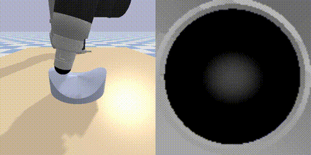
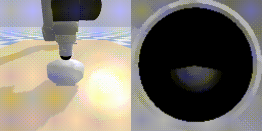
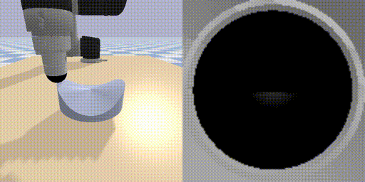
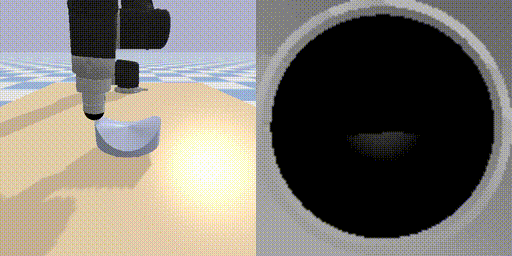

# Tactile Servo Control
[](LICENSE)


**Pose-Based Tactile Servoing**: [Video](https://www.youtube.com/watch?v=12-DJeRcfn0)&nbsp;&nbsp;•&nbsp;&nbsp;[Paper](https://ieeexplore.ieee.org/document/9502718)

This repo contains an implementation of the "*Pose-Based Tactile Servoing: Controlled Soft Touch Using Deep Learning*" [paper](https://ieeexplore.ieee.org/document/9502718). 

The data collection and servo control procedures are implemented in the [Tactile Sim](https://github.com/dexterousrobot/tactile_sim) simulation platform. 

There are four main tasks sharing the same underlying data collection, learning and servo control methods. These are **Surface Following 3D**, **Edge Following 2D**, **Edge Following 3D** and **Edge Following 5D**.

<p align="center">
    &nbsp;&nbsp;&nbsp;&nbsp;
   &nbsp;&nbsp;&nbsp;&nbsp;<br>
   &nbsp;&nbsp;&nbsp;&nbsp;
   &nbsp;&nbsp;&nbsp;&nbsp;
</p>


### Content ###
- [Installation](#installation)
- [Arguments](#arguments)
- [Data Collection](#data-collection)
- [Learning](#learning)
- [Prediction](#prediction)
- [Servo Control](#servo-control)
- [Bibtex](#bibtex)


### Installation ###

This work relies on the [Tactile Sim](https://github.com/dexterousrobot/tactile_sim), [Tactile Learning](https://github.com/dexterousrobot/tactile_learning) and [Tactile Data](https://github.com/dexterousrobot/tactile_data) reposotories. Please follow installation instructions within these repos first.

Install Tactile-Gym Servo Control

```
git clone https://github.com/dexterousrobot/tactile_servo_control.git
cd tactile_servo_control
pip install -e .
```

### Arguments ###

These can be found in ```utils/parse_args.py```.

| **Argument** |  **Description** |  **Options**  | 
| ---------------------|  ----------------------- |  ------------------ | 
| `-r` `-robot`    | Which robot is being used for data collection. This is also used to find directory of training data or pre-trained models. | `sim_ur` `ur` `sim_cr` `cr` `mg400`  |
| `-s` `-sensor` | Which sensor is being used for data collection. This is also used to find directory of training data or pre-trained models. | `sim_tactip` `tactip_127` `tactip_331` |
| `-t` `-tasks` |  This indicates the type of data that will be collected or the type of data to be used during training. | `surface_3d` `edge_2d` `spherical_probe`  |
| `-n` `-sample_nums` | ... | e.g. `[400, 100]`  |
| `-dd` `-data_dirs` |  ... |  e.g. `[train, val]`   |
| `-dt` `-train_dirs` |  ... | `train`  |
| `-dv` `-val_dirs` |  ... | `val`  |
| `-m` `-models` |  NN architecture to be trained. | `pix2pix` |
| `-mv` `-model_version` |  Additional string to append to the model directory. | `exp_v1` `exp_v2` |
| `-o` `-objects` | Objects to load into environmet. Multiple objects will be loaded sequentially. | `circle` `square` `clover` `foil` `saddle` `bowl` |
| `-rv` `-run_version` |  Additional string to append to the run directory. | `exp_v1` `exp_v2` |
| `-d` `-device` |  Whether to run on the GPU or CPU | `cuda` `cpu` |

### Data Collection ###

Example data is provided in the [Tactile Data](https://github.com/dexterousrobot/tactile_data) reposortory. Alternate data can be quickly generated and gathered in simulation using

```
python data_collection/launch_collect_data.py -t task_name
```

where task_name is selected from ```[surface_3d edge_2d edge_3d edge_5d]```. If multiple tasks are input they will be executed in the order of input.

This can be generated significantly faster with rendering and GUI disabled on Ubuntu however a bug for pybullet on Windows causes a crash during collection in this case. The GUI should be enabled if using a Windows machine for data collection.

### Learning ###

This directory contains helper files for launching supervised learning algorithms through the [Tactile Learning](https://github.com/dexterousrobot/tactile_learning) reposortory.

The aim is to predict the pose of the tactile sensor based on the tactile image gathered during data collection.  Pose is encoded and decoded for accurate NN prediction, this uses normalisation for position and  sine/cosine encoding for rotation. Details of this can be found in ```utils/label_encoder.py```.

Image processing and augmentations are used for more robust learning. To visualise the effects of these run

```
python learning/demo_image_generation.py -t task_name
```

To train a CNN for pose prediction run

```
python learning/launch_training.py -t task_name -d device_name
```
This will overwrite the pretrained models used for demonstrations.

The task, learning and image processing parameters are set within the code. For efficient learning, parameters may need to be tweaked depending on your setup.

A learned model can be evaluated by running

```
python prediction/evaluate_model.py -t task_name -d device_name
```

The model and algorithm hyper-parameters are set in `learning/setup_training.py`. These can be optimised by running

```
python learning/launch_hyper_training.py -t task_name -d device_name
```

### Servo Control ###

Demonstration files are provided for all tasks in the example directory. These use pretrained models included in the repo, training your own models will overwrite these pretrained models. The main logic for servo control is provided in ```servo_control/servo_control.py```.

To demonstrate servo control, from the base directory run

```
python servo_control/servo_control.py -t task_name -d device_name
```
The task can be selected by adjusting the code.

### Bibtex ###

Pose-Based Tactile Servoing
```
@InProceedings{Lepora2021PBTS,
  author={Lepora, Nathan F. and Lloyd, John},
  journal={IEEE Robotics & Automation Magazine},
  title={Pose-Based Tactile Servoing: Controlled Soft Touch Using Deep Learning},
  year={2021},
  volume={28},
  number={4},
  pages={43-55},
  doi={10.1109/MRA.2021.3096141}
  }

```
Tactile Gym 2.0
```
@InProceedings{lin2022tactilegym2,
     title={Tactile Gym 2.0: Sim-to-real Deep Reinforcement Learning for Comparing Low-cost High-Resolution Robot Touch},
     author={Yijiong Lin and John Lloyd and Alex Church and Nathan F. Lepora},
     journal={IEEE Robotics and Automation Letters},
     year={2022},
     volume={7},
     number={4},
     pages={10754-10761},
     editor={R. Liu A.Banerjee},
     series={Proceedings of Machine Learning Research},
     month={August},
     publisher={IEEE},
     doi={10.1109/LRA.2022.3195195}}
     url={https://ieeexplore.ieee.org/abstract/document/9847020},
}
```

Tactile Gym 1.0
```
@InProceedings{church2021optical,
     title={Tactile Sim-to-Real Policy Transfer via Real-to-Sim Image Translation},
     author={Church, Alex and Lloyd, John and Hadsell, Raia and Lepora, Nathan F.},
     booktitle={Proceedings of the 5th Conference on Robot Learning},
     year={2022},
     editor={Faust, Aleksandra and Hsu, David and Neumann, Gerhard},
     volume={164},
     series={Proceedings of Machine Learning Research},
     month={08--11 Nov},
     publisher={PMLR},
     pdf={https://proceedings.mlr.press/v164/church22a/church22a.pdf},
     url={https://proceedings.mlr.press/v164/church22a.html},
}
```
